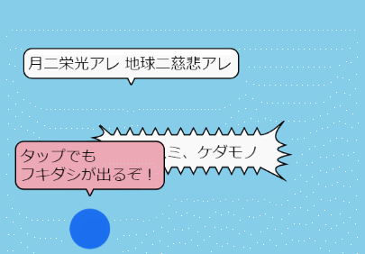
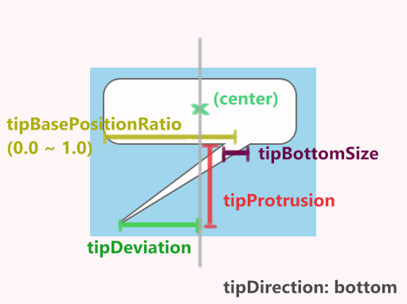

# phina-talkbubble.js

[](https://pentamania.github.io/phina-fukidashi/sample/crowd.html)

マンガのフキダシ、棘付きのフキダシっぽいものを描画するためのphina.js用プラグインです。  
phina.js extention to render comic-like talk bubbles.  

**[サンプル](https://pentamania.github.io/phina-talkbubble/sample/crowd.html)**

## Sample (In-browser)

```html
<!DOCTYPE html>
<html lang="ja">
<head>
  <meta charset="utf-8">
  <meta http-equiv="x-ua-compatible" content="IE=Edge">
  <meta name="viewport" content="width=device-width,initial-scale=1.0,minimum-scale=1.0,maximum-scale=1.0,user-scalable=no">
  <title>sample</title>
</head>
<body>

<script src='http://cdn.rawgit.com/phi-jp/phina.js/v0.2.1/build/phina.js'></script>
<script src='./path/to/phina-talkbubble.js'></script>
<script>

phina.globalize();

phina.define('MainScene', {
  superClass: 'DisplayScene',

  init: function(options) {
    this.superInit(options);

    // フキダシ
    phina.display.TalkBubbleShape({
      tipDirection: 'bottom',
    }).addChildTo(this);

    // テキスト入りフキダシ
    phina.ui.TalkBubbleLabel({
      text: "Hello world!",
      tipDirection: 'right',
    }).addChildTo(this);

    // トゲトゲフキダシ
    phina.display.ThornedTalkBubbleShape({
      sideThornSize: 20,
    }).addChildTo(this);

    // テキスト入りトゲトゲフキダシ
    phina.ui.ThornedTalkBubbleLabel({
      text: "Hello world!",
      sideThornInterval: 20,
    }).addChildTo(this);

  },
});

phina.main(function() {
  var app = GameApp({
    startLabel: 'main',
  });

  app.run();
});

</script>
</body>
</html>
```

## Sample (ES modules)

#### install
```
npm i -S pentamania/phina-talkbubble
```

#### usage
```js
import * as phina from 'phina.js';
import 'phina-talkbubble';

phina.globalize();

phina.define('MainScene', {
  superClass: 'DisplayScene',

  init: function(options) {
    this.superInit(options);

    phina.display.TalkBubbleShape({
      tipDirection: 'bottom',
    }).addChildTo(this);

    /* ... */
  },
});

phina.main(function() {
  var app = GameApp({
    startLabel: 'main',
  });

  app.run();
});
```

## Class & Options

#### phina.display.TalkBubbleShape
フキダシ型のシェイプを描画します。



Name | Type | Note
--- | --- | ---
cornerRadius | Number | フキダシの角丸具合を指定。
tipDirection | String | 先端の方向を指定。top, right, bottom, leftのいずれかを指定
tipBasePositionRatio | Number (0 ~ 1.0) | 先端部中心が左右（もしくは上下）どこに位置するかを比率で指定
tipBottomSize| Number | 先端部底面のサイズを指定
tipDeviation | Number | 先端がフキダシ中央からどれくらいズレているかを指定
tipProtrusion | Number | 先端がフキダシからどれだけ飛び出ているかを指定

※仮のものなので「こういうオプション設定・名前のほうがいいんじゃない」とかあればお知らせ下さい…。

#### phina.display.ThornedTalkBubbleShape
トゲ付きフキダシのShapeクラスを描画します。トゲトゲのサイズや間隔を指定できます。  
TalkBubbleShapeと違って口部分はありません。

Name | Type | Note
--- | --- | ---
sideThornInterval | Number | 左右のトゲトゲの間隔を指定
sideThornSize | Number | 左右のトゲトゲの大きさを指定
verticalThornInterval | Number | 上下のトゲトゲの間隔を指定
verticalThornSize | Number | 上下のトゲトゲの大きさを指定

#### phina.ui.TalkBubbleLabel & phina.ui.ThornedTalkBubbleLabel
LabelAreaと組み合わせてフキダシ内にテキストを描画します。  
どちらも上記の(Thorned)TalkBubbleShapeやLabelArea関連のオプションに加え、以下のオプションが設定可能。

Name | Type | Note
--- | --- | ---
text | String | そのまま。改行文字（\n）を挟むことも可能
bubbleFill  | String or Number(hex) | フキダシのfill style
bubbleStroke | String or Number(hex) | フキダシのstroke style
textFill | String or Number(hex) | テキストのfill style
textStroke | String or Number(hex) | テキストのstroke style
fit | Boolean | テキスト領域に合わせてフキダシをリサイズするかどうか（初期値：true）

## Known bugs
- 半角英数字のテキストだと最後の文字が切れてしまう時があります。その場合、最後に空白文字を入れて調整すれば一応表示されます。

## LICENSE
MIT
